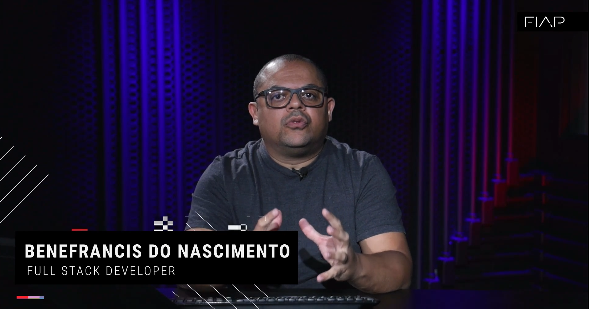
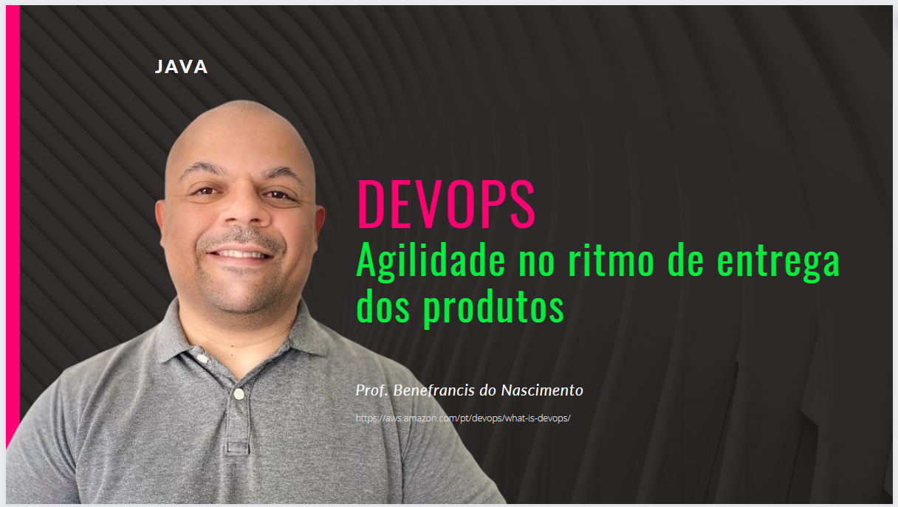

<!--  https://devicon.dev/  -->

 
  </a>
  
  
   

   
  
Hello! My name is <strong>Benefrancis</strong>

  

I'm a software engineer

<h2>Frontend</h2>

 

  

  

  

  

  

  

  

 

##

<h2>Backend</h2>

 

  

  

  

 

  

 

<h2>Database</h2>

  

  

  

  

 

<h2>Integration</h2>

 

  

  

  

  

  

In 2022 I was hired as a Domain Driven Design teacher at FIAP, where I have been teaching Java, Object Oriented Programming, JPA Object-Relational Mapping and Hibernate for undergraduate courses in Information Technology for Technology courses in Systems Analysis and Development. I have also been an instructor for an online Java course on the institution's platform.

 
</img>
</img>
</img>
</img>

With the personal project, I'm developing various technology classes for sharing knowledge:

</img>
</img>
</img>
</img>
</img>
</img>

</img>
</img>
</img>
</img>

##          

In 2021 I developed the <a href="https://agua.mpf.mp.br/" target="_blank">Água Boa de Beber</a> tool. This tool is a web application to expose Brazilians to the analysis data of the quality of the water we drink. I started researching and modeling public data from water quality analyzes published by sanitation and water supply companies.

The video that presents the tool is published on youtube and can be accessed clicking on the image below:

The tool was a success, it aroused the interest of public administrators about the responsibility of making data transparent to the population. I was interviewed by the television channel, Watch the video clicking on the image below:

##

In 2020 - 2021

I was responsible for developing the access permissions control system for the Federal Public Ministry, acting as Project Manager (Agile Scrum methodology), Developer and Designer. In this project I worked with the following technologies:

Angular 11+, Java 8, Spring Boot, JPA, jenkins, continuous integration, Gitlab, Oracle, Git, TypeScript.

Here are some images of the application's main screens:

</img>

</img>

</img>

</img>

</img>

</img>

In 2019 I became a collaborator (pro bono - voluntary activity) of the Water Connection project. I started to study public data on water quality in Brazil. Modeled the data using datawarewouse techniques, generated analytical reports with the ELK stack (Elasticsearch, Logstash and Kibana). With that, I started to show the results of the data for the other collaborators of the project as well as for prosecutors in the environmental area, judges, researchers, academic entrepreneurs and etc.

##

 
In 2018 I developed  the website of the water connection project that is classified in the area of ​​governance and sustainability management.

In 2013, I developed the site Brasil Nunca Mais Digital, a successful project that already has more than 5.5 million documents accessed since August 2013.

The project aims to to keep the memory of the dictatorial period in Brazil. We can define BRAZIL: NEVER AGAIN as the most comprehensive investigation about torture carried out by citizens in their country.

##

In 2012, I developed the routine for distributing lawsuits for the regional prosecutors of the republic.

  

## Old Projects

Time passes too quickly. I'm proud of every job I do. I've learned a lot from all of them.

I met people and was challenged to innovate, improvise, work in groups, be accountable and bring results to my clients. Below are some of my old projects.

###

### 2010 - Free Workbook - "Desenvolva Passo a Passo um Sistema Web com Java + JPA ..." 

The idea was to distribute a tutorial to help new developers work with Java for the web, using the technologies available at the time.

The project developed was a petshop.

### 2009 - MPT NEWS (MPT NOTÍCIAS) 

A system for registering and maintaining news from the Prosecutor's Office. This system allowed headlines to be registered in a variety of formats, it was also possible to send direct mailings and the news was automatically made available on the Prosecutor's Office portal.

### 2009 - Portal of the Regional Labor Prosecutor's Office of the 15th Region - Campinas - SP

I created a new portal for the prosecutor's office. On this portal, I made various services available to the community. Such as the possibility of consulting the labor cases in which the prosecutor's office was acting, a transparency module for the expenses incurred by the prosecutor's office where various information was made available on the transparency of the use of public money, a tool for citizens to know in which unit they could be served more quickly...among others.

### 2008 - SAPS (Sistema para Administração de Perícias dos Servidores do INSS)

I developed an application for the Brazilian Social Security system to include and control medical examinations carried out by civil servants. This application worked in conjunction with the scheduling system, as summarized below:

- The branch offices schedule the medical examinations of the civil servants under their responsibility in slots previously created by the executive management's HR department in the SAPS intranet system (implemented in January 2008);
- The civil servant attends on the appointed day and time;
- The medical expert will access the appointment made and type the examination into the system. This examination must be recorded in a database and the report filed in the server's file.

### 2006 - SABER ( Extremely Fast Library Administration System )

### 2006 - Site e Web Portifólio da Francana Metal 

In partnership with Ponto4 Digital, I developed the Francana Metal website.

### 2004 - Site - Beautiful jewelry * Lindas Joias * 

##

  <a href="https://github.com/benefrancis" target="_blank">
  
  

